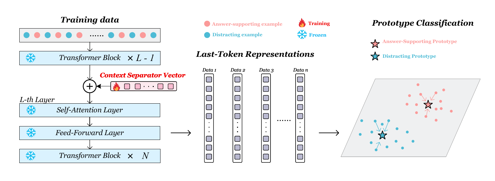

# Steering Representations for Retrieved-Context Utility in Retrieval-Augmented Generation


The main method is a **Context Separator Vector (CSV)**. CSV learns a small
steering vector in a frozen LLM. No target LLM weights are fine-tuned.

For a question-document pair `(q, d)`, a learned vector `v` is injected into an
intermediate transformer layer `k`:

$$
\widetilde{H}^{k} = H^{k} + \lambda v
$$

The modified hidden states are propagated through the remaining frozen layers.
At a classification layer `c`, the last prompt-token representation is compared
with answer-supporting and distracting prototypes. In the end-to-end pipeline,
the retrieved-document classifier is used as a document-level gate: if the top-1
retrieved document is predicted useful, the selected RAG/decoding method is run;
otherwise generation falls back to a no-document prompt.


## Framework Diagram




## Install

Use Python 3.10 or newer. Install the repository dependencies:

```bash
pip install -r requirements.txt
```


```text
Self-RAG baseline: vllm and a local Self-RAG checkpoint
CRAG baseline: local CRAG model files
DoLA generation: third_party/transformers-community-dola/custom_generate/generate.py
```

## Environment

Set local model paths before running hidden-state extraction, CSV training, or
generation:

```bash
export GEMMA_MODEL_PATH=/path/to/google/gemma-2-2b
export GEMMA9B_MODEL_PATH=/path/to/google/gemma-2-9b
export QWEN3_4B_MODEL_PATH=/path/to/Qwen3-4B-Base
export DOLA_CUSTOM_GENERATE=$PWD/third_party/transformers-community-dola/custom_generate/generate.py
```

If the models are already cached locally:

```bash
export HF_HUB_OFFLINE=1
export TRANSFORMERS_OFFLINE=1
```

Step 3 uses an external LLM annotator. To rebuild annotations from scratch, set:

```bash
export GPT_API_KEY=<your_api_key>
```


## Data Expected by the Code


```text
data/dpr_download/nq-train.json
data/dpr_download/trivia-train.json
data/dpr_download/nq-test.csv
data/dpr_download/trivia-test.csv
data/dpr_download/wiki_dpr_nq/
data/dpr_download/wiki_dpr_nq.faiss
```

Generated data and caches follow this layout:

```text
data/queries/                    Step 1 query extraction
data/retrieved/                  Step 2 DPR top-1 retrieval
data/annotated/                  Step 3 LLM annotation
data/final/                      Gold-vs-distractor data and QA test files
data/final_retrieved/            Retrieved-document utility data
data/hidden_states/              Gold-vs-distractor hidden-state caches
data/hidden_states_retrieved/    Retrieved-document hidden-state caches
results/                         Metrics, checkpoints, generations, summaries
```

If processed data, hidden states, or checkpoints are provided separately, place
them in the same paths and skip the corresponding earlier stages.

## Reproduction Path

Run commands from the repository root.

### 1. Build the Datasets

```bash
python scripts/step1_extract_queries.py
python scripts/step2_retrieve.py
python scripts/step3_annotate.py
python scripts/step4_build_dataset.py
python scripts/step4b_build_retrieved_dataset.py
python scripts/step5_prepare_test.py
```

Expected key files:

```text
data/final/train.json
data/final/eval.json
data/final_retrieved/train.json
data/final_retrieved/eval.json
data/final/test_retrieval_nq.json
data/final/test_retrieval_triviaqa.json
```

### 2. Extract Hidden States

Gold-vs-distractor diagnostic setting:

```bash
CUDA_VISIBLE_DEVICES=0 python scripts/step6_extract_hidden_states.py --model gemma2b --batch_size 32
CUDA_VISIBLE_DEVICES=0 python scripts/step6_extract_hidden_states.py --model qwen3_4b --batch_size 4
```

Retrieved-document utility setting:

```bash
CUDA_VISIBLE_DEVICES=0 python scripts/step6_extract_hidden_states_retrieved.py --model gemma2b --batch_size 32
CUDA_VISIBLE_DEVICES=0 python scripts/step6_extract_hidden_states_retrieved.py --model qwen3_4b --batch_size 4
```

Use `--model all` to run every registered model. The 9B model requires more GPU
memory and may need a smaller batch size.

### 3. Train Probe and External Baselines

Hidden-state probe baselines:

```bash
python scripts/step8_train_probe.py --model all --classifier all
python scripts/step8_train_probe_retrieved.py --model all --classifier all
```

DPR score baselines:

```bash
python scripts/step8b_dpr_baseline.py
python scripts/step8b_dpr_baseline_retrieved.py
```

Optional external evaluator baselines:

```bash
CUDA_VISIBLE_DEVICES=0 python scripts/step8_crag_baseline.py --mode retrieved
CUDA_VISIBLE_DEVICES=0 python scripts/step8_selfrag_baseline.py --mode retrieved --model_name /path/to/selfrag_llama2_13b
```

### 4. Train CSV Classifiers

Gold-vs-distractor CSV, used as a separability diagnostic:

```bash
bash scripts/run_step9_dual_gpu.sh
bash scripts/run_step9_gemma9b.sh
bash scripts/run_step9_qwen3_4b.sh
python scripts/step9b_reeval_per_subset.py --model all
```

Retrieved-document CSV, used by the generation gate:

```bash
bash scripts/run_step9r_gemma2b.sh
bash scripts/run_step9r_gemma2b_cls18_inject_sweep.sh
bash scripts/run_step9r_qwen3_4b.sh
bash scripts/run_step9r_qwen3_4b_cls22_hparam_grid.sh
```

The main retrieved-document CSV checkpoints used by the pipeline are:

| Model | Injection layer `k` | Classification layer `c` | Notes |
|---|---:|---:|---|
| Gemma2-2B | 14 | 18 | best retrieved-doc gate in the experiment ledger |
| Qwen3-4B | 21 | 22 | best hparam-grid checkpoint used for pipeline evaluation |


### 5. Run Generation and Evaluation

Baseline generation plus evaluation:

```bash
CAD_ALPHA=0.5 SKIP_EXISTING=1 bash scripts/run_step11_greedy_baselines_with_eval.sh gemma2b all 0
CAD_ALPHA=0.5 SKIP_EXISTING=1 bash scripts/run_step11_greedy_baselines_with_eval.sh qwen3_4b all 0
```

CSV-gated generation:

```bash
for METHOD in csv_gated_vanilla_rag csv_gated_cad csv_gated_acd csv_gated_context_ucd csv_gated_dola; do
  METHOD="$METHOD" ALPHAS="0.5" TAUS="0.5 0.4 0.3" SKIP_EXISTING=1 \
    bash scripts/run_step11_cad_alpha_sweep_with_eval.sh gemma2b all 0
done
```

Repeat the same loop with `qwen3_4b` in place of `gemma2b` for Qwen3-4B
pipeline results.

Rebuild evaluation summaries from existing generation files:

```bash
python scripts/step12_evaluate_pipeline.py --all
python scripts/collect_finished_results.py
```

Main pipeline outputs are written to:

```text
results/pipeline/
results/pipeline/pipeline_eval_summary.csv
results/pipeline/pipeline_eval_summary.json
results/all_finished_experiments.csv
```

## Result Files and Provenance

The expected output directories are:

```text
results/probe/                                  gold-vs-distractor probe baselines
results/probe_retrieved/                       retrieved-document probe baselines
results/csv/                                   gold-vs-distractor CSV metrics
results/csv_retrieved/                         retrieved-document CSV metrics
results/csv_retrieved_qwen3_4b_best_for_pipeline/
results/pipeline/                              generation and EM/F1 evaluation
results/analysis/                              paper-table summaries
results/manual_validation/                     manual label validation summaries
```


## Sanity-Check Numbers

After a successful retrieved-document run, the main utility classifiers should
be close to:

| Model / classifier | Combined AUROC | Combined accuracy |
|---|---:|---:|
| Gemma2-2B LR probe | 0.8497 | 0.7536 |
| Gemma2-2B CSV | 0.9029 | 0.8375 |
| Qwen3-4B LR probe | 0.8918 | 0.8262 |
| Qwen3-4B CSV | 0.9159 | 0.8553 |

For the gold-vs-distractor diagnostic setting, CSV reaches approximately
`0.996` AUROC on Gemma2-2B and Qwen3-4B, and approximately `0.997` AUROC on
Gemma2-9B.

The end-to-end pipeline compares:

```text
no_doc
vanilla_rag
cad_fixed
acd
context_ucd
dola
csv_gated_vanilla_rag
csv_gated_cad
csv_gated_acd
csv_gated_context_ucd
csv_gated_dola
```

The gated methods use the retrieved-document CSV classifier before generation.
`tau` is the utility threshold; the experiment ledger records runs for
`tau in {0.5, 0.4, 0.3}`.


